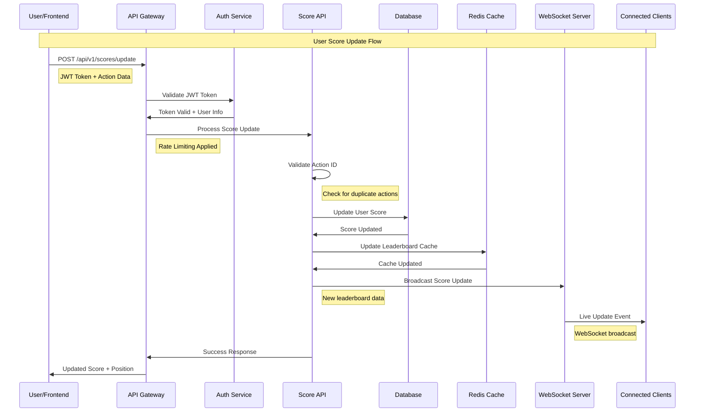
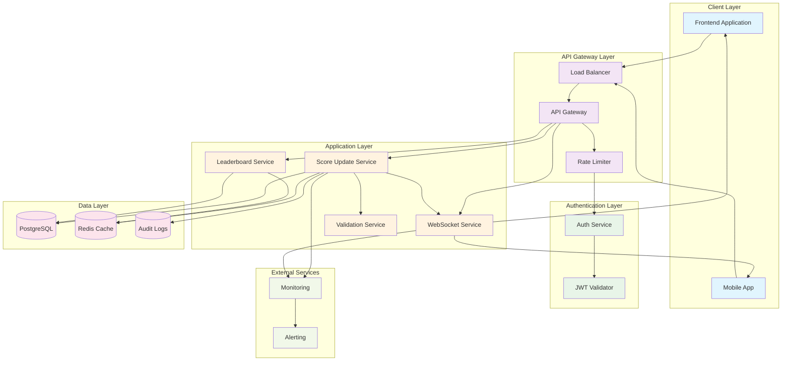
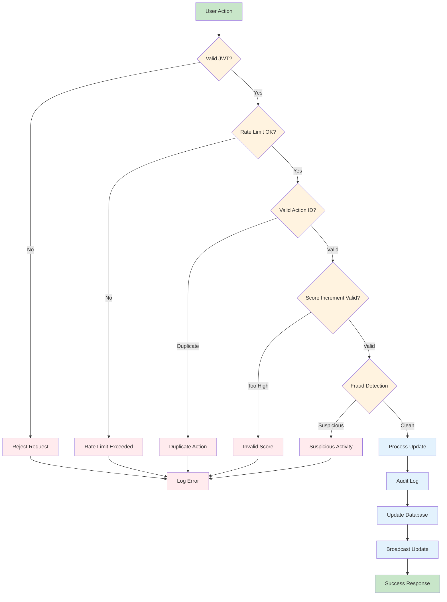
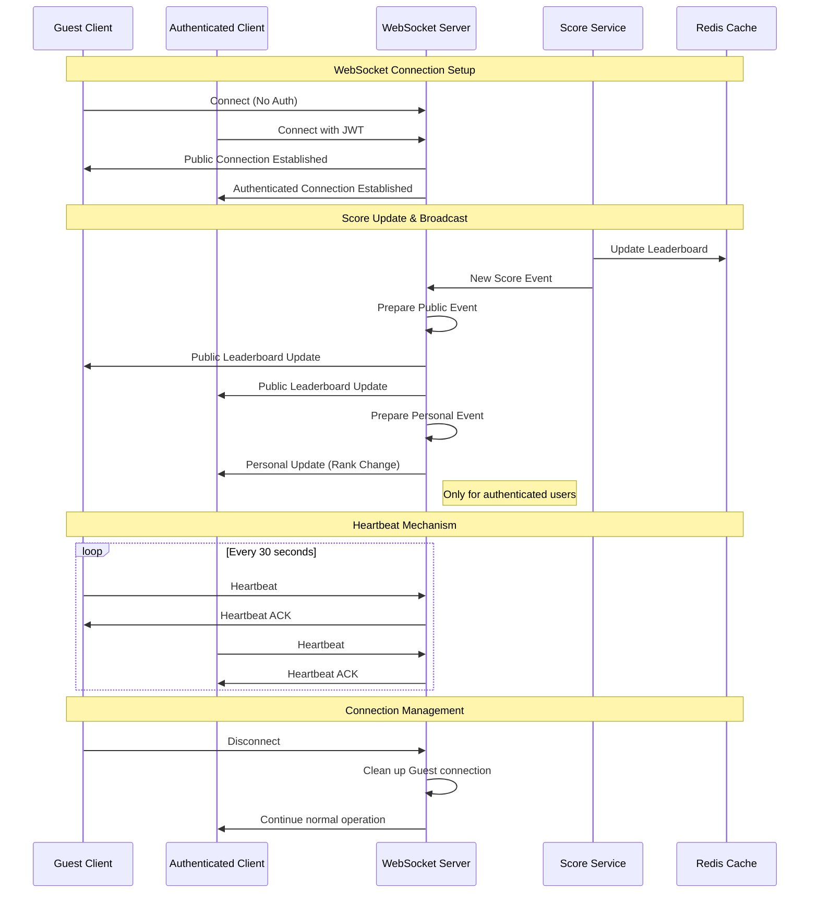
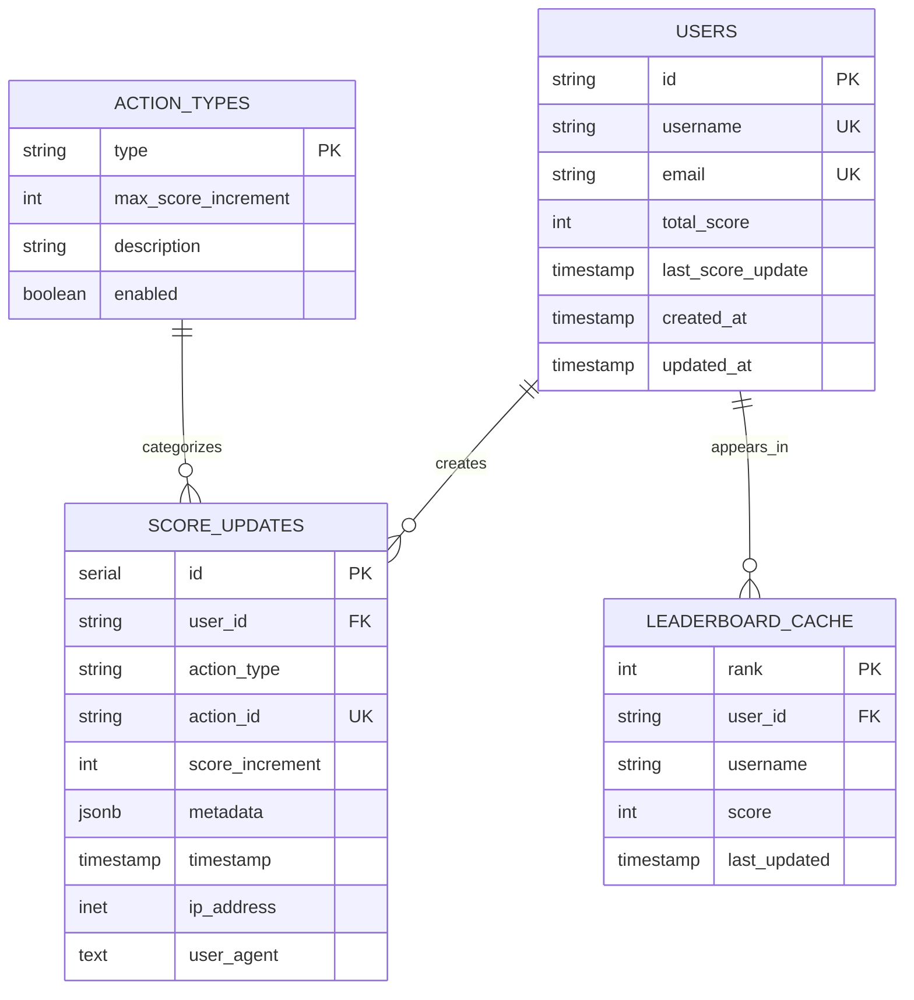
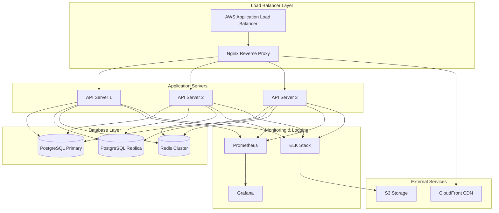

# Live Scoreboard API - Architecture Diagrams

## System Flow Diagram

## System Architecture Diagram

## Security Flow Diagram

## Real-time Communication Flow

## Database Schema Relationships

## Deployment Architecture

These diagrams provide visual representations of:

1. **System Flow**: Step-by-step sequence of operations for score updates
2. **System Architecture**: High-level component relationships and data flow
3. **Security Flow**: Decision tree for request validation and fraud prevention
4. **Real-time Communication**: WebSocket connection lifecycle and event broadcasting (including public access)
5. **Database Schema**: Entity relationships and data structure
6. **Deployment Architecture**: Production infrastructure layout

The diagrams can be rendered using any Mermaid-compatible viewer or integrated into documentation systems that support Mermaid syntax.